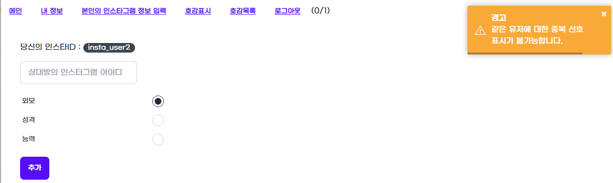
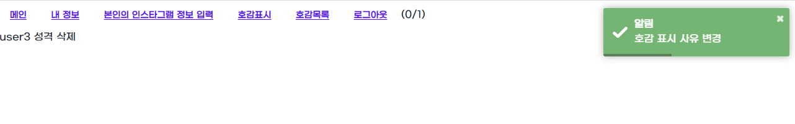
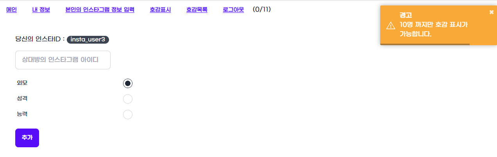

# 할 일
- [x] 한명의 인스타 회원 -> 다른 인스타 회원 중복 호감 표시 확인
  - [x] 해당 member가 호감 표시한 사람들 리스트 불러오기 
  - [x] 해당 member가 호감 표시한 사람들 한 명씩 거내서 선택한 username가 동일한 사람이 있는 지 확인
    - [x] 동일한 경우, 기존의 사유와 같은 사유로 호감 표시를 했으먄 rq.historyBack으로 처리되도록 처리 
    - [x] 동일하지 않은 경우, resultCode = S-2를 리턴하고 호감사유를 변경 
- [x] 한명의 인스타회원이 11명 이상의 호감상대를 등록하지 못하도록 처리 
  

# 접근 방법

✍ 할 일 리스트를 체크하면 진행
- resultCode에 따라 rq.historyBack에 다른 메시지 나오도록 구현  
- application.yml에 호감표시할 수 있는 인원에 대한 정보 입력하도록 해서 독립성 확보 

< 이미 호감표시한 회원에 기존 사유로 호감 표시 불가 > 

< 이미 호감표시한 회원에 다른 사유로 호감 표시하면 해당 사유로 변경 > 

< 10명까지만 호감 표시 가능 >

# 특이 사항
🤔 구현 과정에서 아쉬웠던 점 & 어려웠던 점
- 테스트 코드 작성의 미숙함 

🤔 궁금했던 점